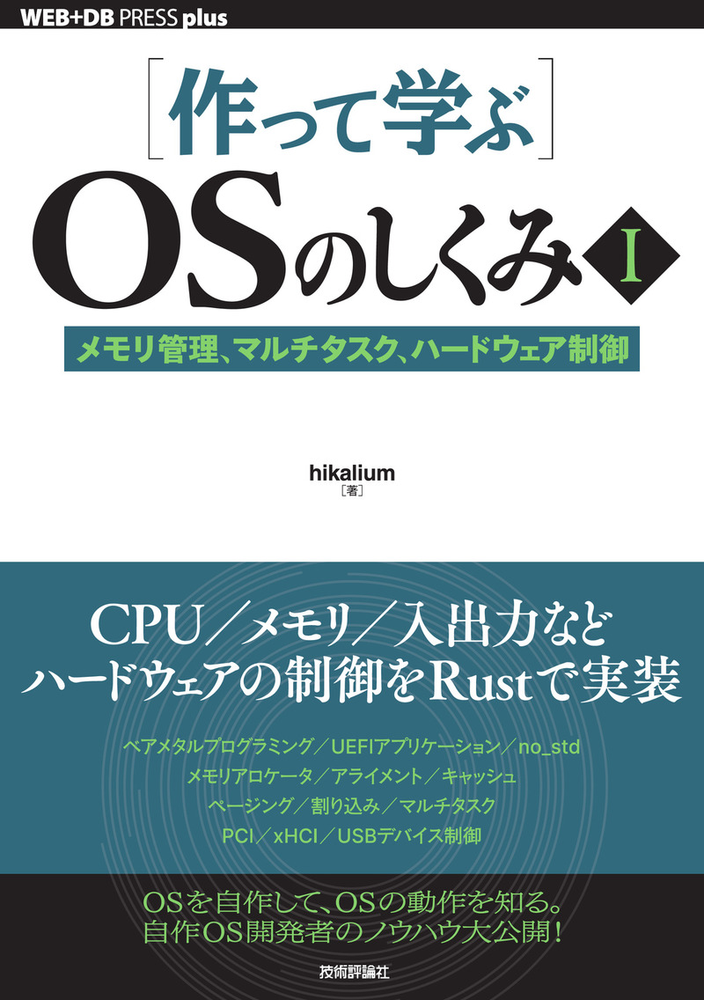
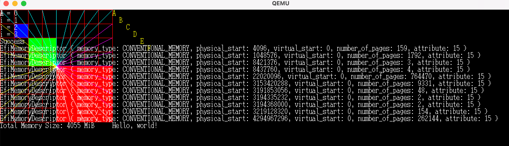
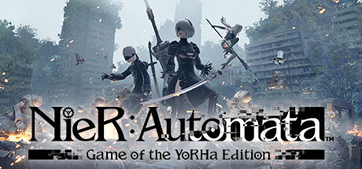
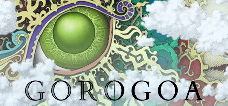
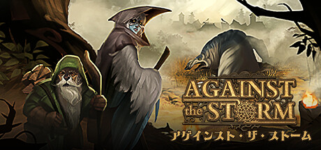

# 年末年始やったこと

2025-2026<br/>
2026年1月9日十川亮平

---
transition: fade-out
layout: two-cols
---

# ［作って学ぶ］ OSのしくみⅠ を読みました（途中）




https://gihyo.jp/book/2025/978-4-297-14859-1

::right::

- **Rust**を使って、OSなしで動くアプリケーションを作ります
- 図形や、テキストもメモリマップを見てVRAMの領域に直接、描画していきます
- printlnなどOSの機能を使って実現しているものが使えないので、自分で実装します
- Rustを勉強しながら、UEFI（Unified Extensible Firmware Interface）や低レイヤーな仕組みを調べながら読んでいたので、すごく時間がかかりました
- かなり興味深く、楽しんでやっていますが、Rust以外は仕事では使わなさそう


---
transition: fade-out
---

# OS無しで図、線、テキストが描画できるようになりました


QEMU（キューエミュ）というエミュレータ上で動かしています。

```ts
unsafe fn unchecked_draw_point<T: Bitmap>(buf: &mut T, x: i64, y: i64, color: u32) {
    // X, Y座標から、ピクセルのアドレスを計算して色を書き込む
    *buf.unchecked_pixel_at_mut(x, y) = color;
}

trait Bitmap {
    fn bytes_per_pixel(&self) -> i64;
    fn pixels_per_line(&self) -> i64;
    fn width(&self) -> i64;
    fn height(&self) -> i64;
    fn bur_mut(&self) -> *mut u8;

  unsafe fn unchecked_pixel_at_mut(&mut self, x: i64, y: i64) -> *mut u32 {
      self.bur_mut().add(
          ((y * self.pixels_per_line() + x) * self.bytes_per_pixel()) as usize,
      ) as *mut u32
  }
```

---
transition: fade-out
---

# ゲームもやりました

|  |  |
|:--|:---------|
| NieR:Automata<br/> 長年積んでいたものをクリアしました！ |   |
| Gorogoa<br/> クリアしました！２時間くらい。<br/>パズルゲーム？  |  |
| Against the Storm アゲインスト・ザ・ストーム<br/>セールで買いました。序盤。<br/>まちづくり＋生産シミュ |  |


